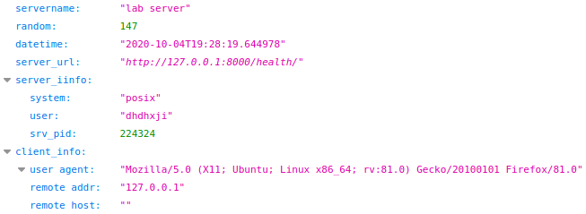
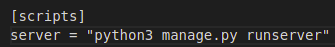

# Lab 3
1. Set up the environment. I have initialized pipenv environment with `pipenv --python 3.8` and install the required dependencies (Django) `pipenv install django` 
2. Started a new Django project (`django-admin startproject lab3_web_page`) and moved all sources to the directory above. 
3. Server works fine =) 
4. Created all templates, add main/templates dir, created `main/templates/main.html`, added `main/urls.py`
5. Created simpe HTHL template, Django view for this template, simple page with JSON response, bound url's to corresponding views.
6. Add some useful information in the health view, that will be sent in the response. There are current server UTC time, requested URL, information about the server ( OS type, the current logged user, server PID), and client information ( user-agent, remote address, remote host). The response of server is shown at the image below 
7. Implemented error logging if the monitoring utility could not connect to the server. Log entry seem like
   ```
   ERROR 2020-10-04 22:57:20,762 root : Unable to conect to the server: HTTPConnectionPool(host='localhost', port=8000): Max retries exceeded with url: /health (Caused by NewConnectionError('<urllib3.connection.HTTPConnection object at 0x7f19dbf31280>: Failed to establish a new connection: [Errno 111] Connection refused'))
   ```
8. Implemented periodic (one time per minute) monitoring the server status and write logs. Time delays are possible by time.sleep() function
9. Implemented alias for quick server startup (pipenv alias)
    