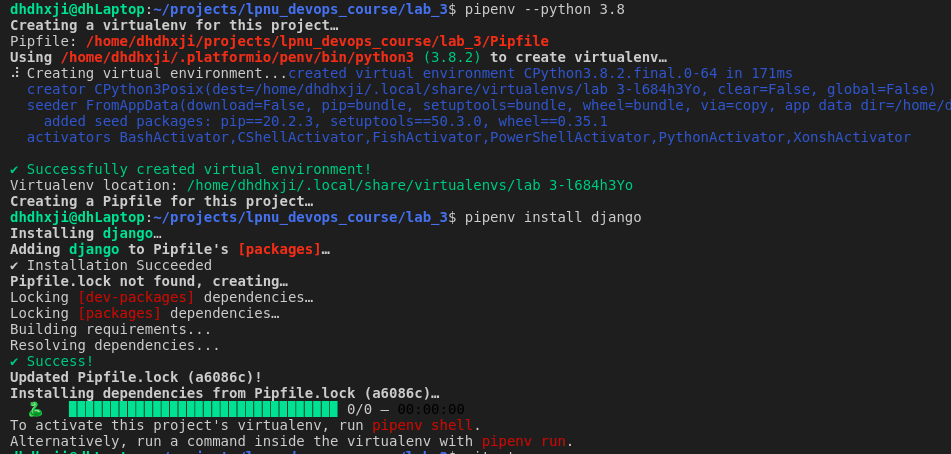
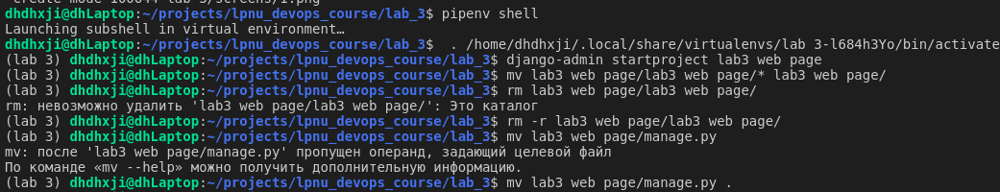
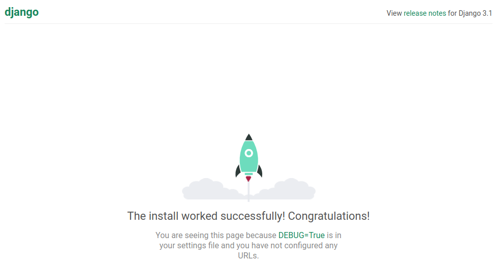

# Lab 3
1. Set up the environment. I have initialized pipenv environment with `pipenv --python 3.8` and install the required dependencies (Django) `pipenv install django` 
2. Started a new Django project (`django-admin startproject lab3_web_page`) and moved all sources to the directory above. 
3. Server works fine =) 
4. Created all templates, add main/templates dir, created `main/templates/main.html`, added `main/urls.py`
5. Created simpe HTHL template, Django view for this template, simple page with JSON response, bound url's to corresponding views.