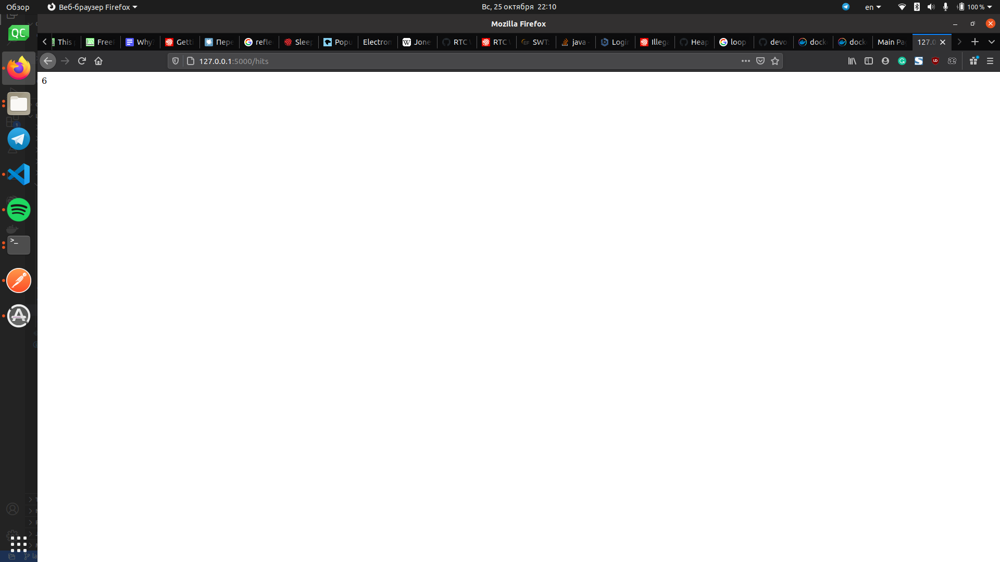
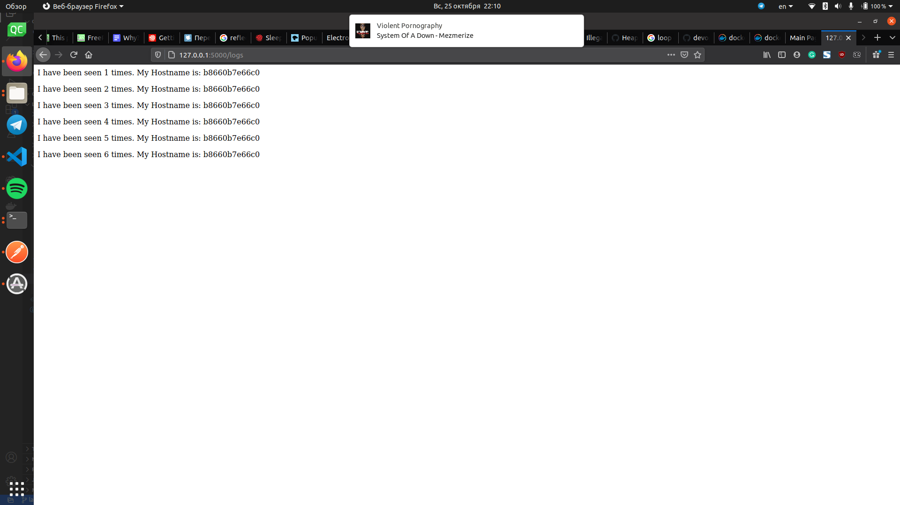

# Lab 5
1. I have read about docker-compose in official doc
1. I have read about flask at official web-page
1. Learn about YAML format
1. Create empty project in this directory
1. Create `my_app` dir for project, `tests` dir for unit tests. In project requirements we can see `flask` and `redis` packages. In unit test deps there are `pytest` and `requests`
1. Install deps, run flask app, check is project in working state, run tests
   ```
   pipenv --python 3.8
   pipenv install -r requirements.txt
   pipenv run python app.py
   ```
   Run tests:
   ```
   pipenv run pytest test_app.py --url http://localhost:5000
   ```
   There is some troubles with unit tests. It fails a few times because before start the server a few thing should be resolved:
   1. On local machine (or anywhere in the network) must be running Redis server. Also app should be configured to use it.
   2. App could not automitically create logs directory. I created it manually. 

   After these manipulations tests passes and all the web pages works fine.
1. Add Dockerfiles's for app and unit tests, create Makefile for deploying.
1. Makefile consists of the next rules:
   - app - run `docker build` for an `Dockerfile.app`, build application container
   - tests - run `docker build` for an `Dockerfile.tests`, build test app container
   - run - create a docker container network, run the redis container, run the app container 
   - test-app - run test app container
   - docker-prune - docker prune (removes all unused containers, networks, volumes, images)
1. Build and run app container with `make app && make run`, run tests with `make tests && make test-app`. All tests has passed. Web app work correctly:
   
   
   
1. Remove all project resources with `make docker-prune`
1. Implemented pushing images to the dockerhub by make's `push target`:
   ```makefile
   push:
   	@$(foreach state,$(STATES), sudo docker push $(REPO):$(state);)
   ```
1. Implemented make rule for all images deletion:
   ```makefile
   images-delete:
      @sudo docker image rm --force $(shell sudo docker images -q)
   ```
   Before deletion:
   ```
         $ sudo docker images
   REPOSITORY            TAG                 IMAGE ID            CREATED             SIZE
   sashakovalchuk/lab5   tests               9f6c9ad14eae        6 minutes ago       135MB
   sashakovalchuk/lab5   app                 d7d473418d37        6 minutes ago       129MB
   vnsq                  0.2.2-build_1       ca32a58e249a        2 days ago          544MB
   vnsq                  latest              ca32a58e249a        2 days ago          544MB
   python                3.7-alpine          4d91c1ce4cc8        3 days ago          41.1MB
   python                3.8-slim            41dcfe21e8fd        5 days ago          113MB
   ubuntu                20.04               9140108b62dc        4 weeks ago         72.9MB
   ubuntu                18.04               56def654ec22        4 weeks ago         63.2MB
   docker/whalesay       latest              6b362a9f73eb        5 years ago         247MB
   ```
   After deletion:
   ```
      $ sudo docker images
   REPOSITORY          TAG                 IMAGE ID            CREATED             SIZE
   ```
1. Create `docker-compose.yml`. This project is litlle bit differs from previous: there is a two network instead of one:
   - public - in this network works public web-interface of application
   - secret - this network used for communication with redis, nobody outside can't accet it
   