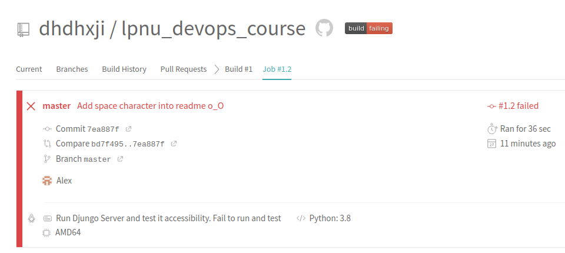

# Lab 6 
1. I have registered in travis CI system and enabled this repo in the Travis settings
1. Learned the [official documentation](https://docs.travis-ci.com/user/for-beginners/)
1. Add .travis.yml file
1. Travis build started (and fails)  
1. After some bugfixes Travis has successfully executed all jobs 
1. Implemented test execution and install by travis from make rule [lab 2]
1. Add monitor container build to the travis build
1. Implement lab 5 homework: pushing containers to the dockerhub via make rule  
1. [Link](https://travis-ci.com/github/dhdhxji/lpnu_devops_course) for my travis build.